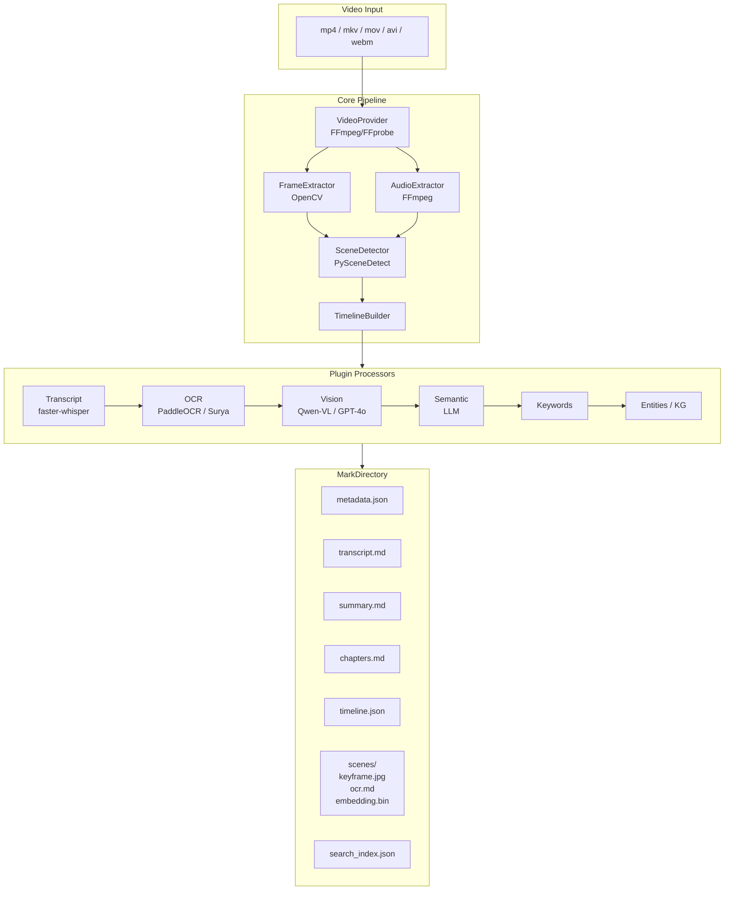
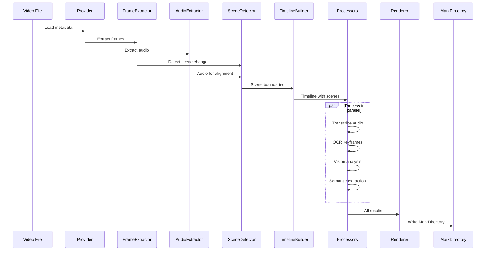

<div align="center">

<!-- VDOC Logo — clean geometric monogram: V formed by document fold with embedded play triangle -->


# VDOC

**Video → Document. Structured. Searchable. Semantic.**

[](LICENSE)
[](https://www.python.org)
[](https://github.com/Sami001-OG/VDOC/actions/workflows/ci.yml)
[](docker/Dockerfile)
[](https://github.com/astral-sh/ruff)
[](https://github.com/Sami001-OG/VDOC)

Converts `mp4`, `mkv`, `mov`, `avi`, `webm`, `flv`, `m4v` into a structured **MarkDirectory** — not a flat transcript dump.

</div>


---

## Features

| Capability | Description |
|---|---|
| **Scene Detection** | Hard cuts, fades, slide changes, camera switches via PySceneDetect |
| **Speech Transcription** | Speaker diarization, word-level timestamps via faster-whisper |
| **OCR Pipeline** | Text extraction from slides, whiteboards, terminals, code editors via PaddleOCR / Surya |
| **Vision Understanding** | Scene descriptions, object detection, UI/component recognition via Qwen-VL / GPT-4o |
| **Semantic Analysis** | Chapter titles, key concepts, definitions, relationships via LLM |
| **Knowledge Graph** | Automatic entity extraction (people, libraries, algorithms, frameworks) |
| **Semantic Search** | Vector embeddings via FAISS + BGE — search transcript, OCR, captions |
| **Plugin System** | `@processor` decorator — add custom processors without modifying core code |
| **Provider-Agnostic** | Switch between OpenAI, OpenRouter, Groq, Ollama, LM Studio, vLLM — change `.env` only |
| **Local Mode** | Fully offline inference with Ollama + local Whisper |
| **Batch Processing** | Process entire directories with `videomarker ./videos/` |
| **REST API** | FastAPI server with auto-generated OpenAPI docs at `/docs` |
| **Web Dashboard** | Next.js dark-theme UI — drag-drop upload, pipeline viz, live logs, scene preview, semantic search |

---

## Architecture



### Pipeline Data Flow



---

## Quick Start

```bash
# Install from source
git clone https://github.com/Sami001-OG/VDOC.git
cd VDOC
pip install -e ".[all]"

# Copy and configure .env
cp .env.example .env
# Edit .env with your API keys

# Process a single video
videomarker lecture.mp4

# Batch process all videos in a directory
videomarker ./videos/

# Process specific components
videomarker lecture.mp4 --transcript
videomarker lecture.mp4 --ocr
videomarker lecture.mp4 --summary
videomarker lecture.mp4 --chapters

# Start the web dashboard
videomarker serve
# Open http://localhost:8080
```

---

## Output: MarkDirectory

Every video becomes a structured directory:

```
lecture.markdir/
├── metadata.json          # Codec, resolution, duration, fps, rotation
├── transcript.md          # Full transcription with speaker labels + timestamps
├── summary.md             # AI-generated chapter-by-chapter summary
├── chapters.md            # Auto-detected chapter boundaries
├── timeline.json          # Machine-readable scene + chapter timeline
├── keywords.md            # Extracted key terms and phrases
├── entities.json          # Knowledge graph: people, libraries, frameworks
├── search_index.json      # FAISS vector index for semantic search
├── scenes/
│   ├── scene_001/
│   │   ├── transcript.md  # Scene-level transcript excerpt
│   │   ├── summary.md     # Scene-specific summary
│   │   ├── caption.md     # Visual description from vision model
│   │   ├── ocr.md         # OCR-extracted text (slides, code, etc.)
│   │   ├── metadata.json  # Scene timestamps + detection confidence
│   │   ├── keyframe.jpg   # Representative frame image
│   │   └── embedding.bin  # Vector embedding for semantic search
│   ├── scene_002/
│   └── ...
├── frames/                # All extracted frames at configurable FPS
├── assets/                # Additional extracted assets
├── thumbnails/            # Preview thumbnails
├── subtitles/             # SRT subtitle file
├── embeddings/            # Full video + chapter-level embeddings
└── manifest.json          # Processing manifest with pipeline metadata
```

---

## Configuration

All configuration lives in `.env`. Change providers by editing only this file:

```bash
# ── LLM Provider ──
# Supported: openai, openrouter, groq, ollama, lm_studio, vllm, sglang
LLM_PROVIDER=openrouter
BASE_URL=https://openrouter.ai/api/v1
API_KEY=sk-or-v1-...
MODEL=qwen/qwen3-32b
VISION_MODEL=qwen/qwen2.5-vl-72b
EMBEDDING_MODEL=BAAI/bge-large-en-v1.5

# ── Processing ──
FRAME_EXTRACTION_FPS=1.0
SCENE_DETECT_THRESHOLD=30.0
GPU_ENABLED=false

# ── Audio ──
WHISPER_MODEL=base
LANGUAGE=

# ── OCR ──
OCR_ENGINE=paddle

# ── Output ──
OUTPUT_FORMAT=markdirectory
INCLUDE_KEYFRAMES=true
```

### Local Mode (no cloud APIs)

```bash
LLM_PROVIDER=ollama
BASE_URL=http://localhost:11434/v1
MODEL=qwen2.5:32b
VISION_MODEL=qwen2.5-vl:72b
GPU_ENABLED=true
DEVICE=cuda
WHISPER_DEVICE=cpu
```

---

## Plugin System

Add custom processors without modifying existing code:

```python
# my_plugin.py — place in videomarker/plugins/ or any registered path
from videomarker.core.processor import Processor
from videomarker.core.plugin import processor

@processor("code_detector", dependencies=["vision"], priority=55)
class CodeDetector(Processor):
    """Detect code-related scenes and extract programming languages."""

    def process(self, context):
        vision_results = context.data.get("vision_results", {})
        code_found = []
        for scene_id, vision in vision_results.items():
            if vision.description and vision.description.is_code:
                code_found.append({
                    "scene_id": scene_id,
                    "language": self._detect_language(vision.description.detailed),
                })
        context.data["code_detections"] = code_found

    def _detect_language(self, description: str) -> str:
        desc_lower = description.lower()
        if "python" in desc_lower or "def " in desc_lower:
            return "python"
        if "javascript" in desc_lower or "function" in desc_lower:
            return "javascript"
        return "unknown"
```

Processors are auto-discovered. See [Plugin Development Guide](docs/guides/plugin_development.md).

---

## REST API

```bash
# Start the API server
videomarker serve
# OpenAPI docs at http://localhost:8080/docs

# Process a video
curl -X POST -F "file=@lecture.mp4" http://localhost:8080/process

# Check status
curl http://localhost:8080/status/{job_id}

# Get timeline
curl http://localhost:8080/timeline/{job_id}

# Get summary
curl http://localhost:8080/summary/{job_id}

# Semantic search
curl -X POST \
  -d "job_id={job_id}&query=recursion+algorithm&top_k=5" \
  http://localhost:8080/search

# Download full MarkDirectory as ZIP
curl http://localhost:8080/download/{job_id} -o output.zip
```

---

## Web Dashboard

A Next.js dark-theme dashboard is available at `webui/`:

```bash
cd webui
npm install
npm run dev
# Open http://localhost:3000
```

Features:
- Drag-and-drop video upload with live progress
- Real-time pipeline status visualization
- Scene grid with keyframe thumbnails
- Interactive timeline explorer with chapter navigation
- Transcript viewer with word-level timestamps
- Semantic search across transcript, OCR, and captions
- OCR text viewer per scene
- Chapter breakdown with seek controls

---

## Docker

```bash
# Start API server
docker compose up

# Run CLI
docker compose run --rm videomarker-cli lecture.mp4

# With GPU support
docker compose up --profile gpu
```

---

## Technology Stack

| Layer | Technology |
|---|---|
| **Language** | Python 3.10+ |
| **Backend** | FastAPI, Typer |
| **Video** | FFmpeg, OpenCV |
| **Scene Detection** | PySceneDetect |
| **Speech** | faster-whisper |
| **OCR** | PaddleOCR, Surya OCR |
| **Vision** | Qwen2.5-VL, GPT-4o, SmolVLM |
| **Embeddings** | BGE, sentence-transformers |
| **Vector Search** | FAISS |
| **Frontend** | Next.js 14, React 18, TypeScript, Tailwind CSS |
| **Config** | pydantic-settings, .env |
| **Testing** | pytest, ruff, mypy |
| **CI/CD** | GitHub Actions |
| **Container** | Docker, Docker Compose |

---

## Development

```bash
# Clone and install
git clone https://github.com/Sami001-OG/VDOC.git
cd VDOC
python -m venv .venv
source .venv/bin/activate   # or .venv\Scripts\activate on Windows
pip install -e ".[dev,all]"

# Run tests
pytest tests/ -v --cov=videomarker

# Lint
ruff check videomarker/

# Type check
mypy videomarker/ --ignore-missing-imports
```

---

## Project Structure

```
VDOC/
├── videomarker/              # Core Python package
│   ├── core/                 # Pipeline, plugin system, base classes
│   ├── models/               # Pydantic data models
│   ├── providers/            # FFmpeg video loading
│   ├── extractors/           # Frame + audio extraction
│   ├── detectors/            # Scene detection
│   ├── processors/           # Transcript, OCR, vision, semantic, entities
│   ├── renderers/            # MarkDirectory output
│   ├── search/               # Embeddings + FAISS search
│   ├── knowledge/            # Knowledge graph builder
│   ├── cli/                  # Typer command-line interface
│   ├── api/                  # FastAPI REST server
│   ├── plugins/              # User-defined processor directory
│   └── config/               # pydantic-settings configuration
├── webui/                    # Next.js dashboard
│   ├── src/
│   │   ├── app/              # Pages (dashboard, job detail, processors)
│   │   ├── components/       # UI, layout, dashboard, job components
│   │   ├── lib/              # API client, types, utilities
│   │   └── hooks/            # useJob, useScene
│   └── ...
├── tests/                    # Unit, integration, e2e tests
├── docker/                   # Dockerfile + docker-compose
├── docs/                     # Architecture overview, plugin guide
└── examples/                 # Sample plugin, usage examples
```

---

## Benchmarks

| Metric | Expected |
|---|---|
| Video duration | 10s — 10+ hours |
| Scene detection (1h video) | < 2 min |
| Transcription (1h, base model) | < 5 min (GPU) |
| OCR per keyframe | < 1s (GPU) |
| MarkDirectory size | 5–20% of source video |

---

## License

[Apache 2.0](LICENSE) © VideoMarker Contributors

---

<div align="center">

**Built with** 


</div>
